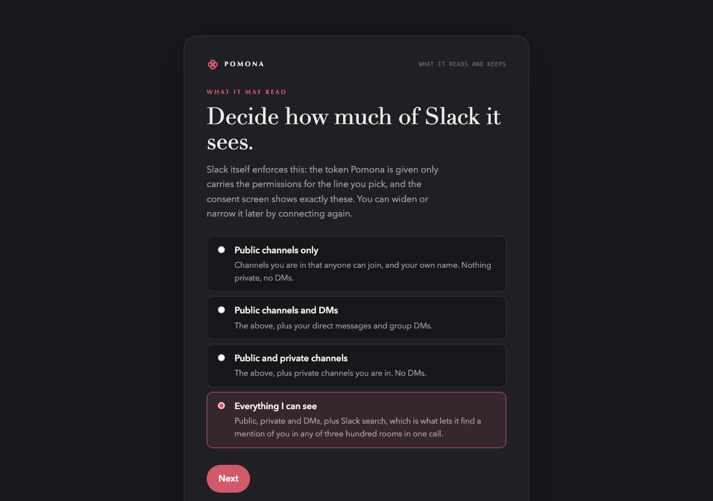
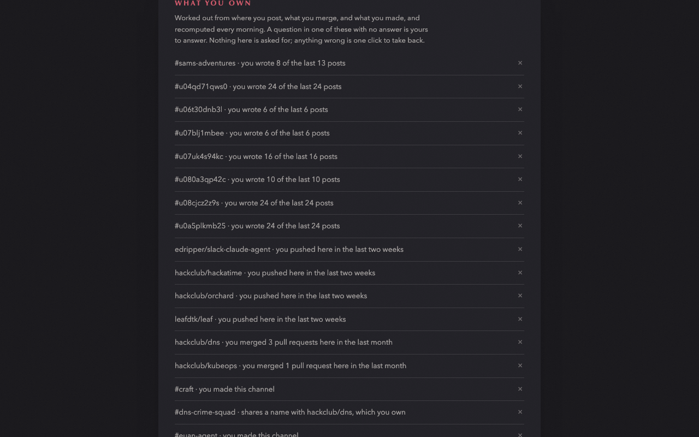

# Pomona

One page every morning, written from what you are actually in the middle of.

Pomona reads your Slack, GitHub, calendar and Linear overnight, works out what is yours, what is being asked of you and what has quietly lapsed, and has Claude write a single page about your day. It is ready before you open the browser, and the browser opens it.


It runs as a small Go server (one binary, no dependencies, everything encrypted at rest) plus a Chrome extension that is only a face for it. Use the hosted one at **pomona.leafd.dev** or run the server yourself; the setup is the same either way.

## How it works

Every morning, twenty minutes before the hour you picked:

1. **Sweep.** Slack is read where you were yesterday first (search for your mentions and for what you said), then the rooms you own, then the rest, inside a fixed time budget. GitHub gives review requests, assignments, notifications and what you merged. Calendar and Linear are one call each. Rooms you ticked as off limits are never fetched.
2. **Store.** Clipped excerpts go into an encrypted signal store with a cursor per room, so tomorrow asks only for what is new. Three days, then gone.
3. **Own.** From where you post, what you merge and what you made, it works out what is yours, with reasons you can read and undo. A room that shares a name with a repository you push to is yours. A room you were just added to surfaces on its own.
4. **Triage.** A small model (Haiku) reads every new excerpt and says what it is: an ask of you, an unanswered question in a place you own, news, done, noise. Direct messages, review requests and severe advisories keep a floor whatever it says.
5. **Judge the old.** Yesterday's to-dos are looked at again: a deck for Tuesday's sync has lapsed by Wednesday. An undated one is let go after two mornings.
6. **Write.** The writing model (Opus by default) sees at most thirty ranked items, your calendar, your last three briefs' to-dos and what you own, and writes the page. The colophon at the bottom says what it cost.

Nothing sits in a loop. The server wakes for the morning and for a click on Regenerate.

## Install

### Just the website

Open **[pomona.leafd.dev](https://pomona.leafd.dev)**. Sign in with Slack or with a code sent to your email, walk through the four choices, and that is it: the brief is written on the server before the hour you picked, and it is there whenever you open the page. No extension. Chrome's "Install Pomona" in the address bar gives it a dock icon and its own window, if you like that.

The extension is optional. It adds exactly two things: it opens the brief in a tab on its own at the hour, or the moment the browser starts if it was written while you were away, and it can notify you. If you would rather open a page yourself, you never need it.

### The extension

1. Download `pomona-extension-<version>.zip` from the [latest release](https://github.com/LeafdTK/pomona/releases), unzip it, open `chrome://extensions`, turn on Developer mode, **Load unpacked**, pick the folder.
2. The setup page opens on its own. Choose **pomona.leafd.dev**, press Connect: a small window signs you in with Slack or with a code sent to your email, and closes.
3. Decide how much of Slack it may read (Slack itself enforces the tier), tick anything it must never read, give it your Claude (a `claude setup-token` token keeps you on your subscription; an API key works too), pick the hour. Name, role and timezone are read from what you connected.



That is the whole of it. Tomorrow's brief is written on its own; today's is one click.

### Your own machine

You need Go 1.26 and, for subscription mode, [Claude Code](https://claude.com/claude-code) signed in.

```sh
git clone https://github.com/LeafdTK/pomona && cd pomona
sh dev/install-service.sh        # builds, installs a launchd agent, starts it at login
```

Or without the service: `go build -o pomona ./server && ./pomona`. Either way the server is at `http://127.0.0.1:7777`, and a browser on the same machine signs in without being asked anything.

Then load the extension unpacked from the repo root and choose **This computer** in setup. With Claude Code on the machine there is no key to paste at all; GitHub is one click if `gh` is signed in.

## Use

- **The page.** Push forward (the one thing two sources make obvious, with a draft when it is a message to send), top to-dos with due dates, new updates with where they happened, your day, and looking ahead. The day's painting is from the Cleveland Museum of Art's open collection.
- **Tick** a to-do and tomorrow knows. **Bury** a place and it stops being gathered. **Doesn't look right?** tells the writer it got something wrong, and that is final.
- **Regenerate** rewrites today's from the store; the sweep is not repeated.
- **Settings** shows what it worked out you own, what it remembers, what you silenced, what faded on its own, and what Claude cost this week. Everything there is one click to undo.



## What it reads and keeps

The short version: only what your Slack tier allows, and Slack enforces the tier; clipped excerpts for three days; the pages it wrote for as long as you choose; your tokens in your own encrypted file; at most thirty excerpts to Claude a morning, and the model never sees a channel list. The whole of it is on the server at `/privacy` and in [PRIVACY.md](PRIVACY.md).

What it cannot promise: whoever runs the server can read the key out of the process, because the process needs it to read your Slack at seven in the morning. A hosted Pomona is a trust in whoever hosts it. Running it yourself is one binary.

## Self-hosting

```sh
docker build -t pomona .
docker run -p 7777:7777 -v pomona-data:/data \
  -e POMONA_VAULT_KEY="$(openssl rand -base64 32)" \
  -e POMONA_SLACK_CLIENT_ID=… -e POMONA_SLACK_CLIENT_SECRET=… \
  -e POMONA_RESEND_KEY=… \
  pomona
```

| Variable | Meaning |
|---|---|
| `POMONA_ADDR` | Listen address. Anything but loopback is *hosted mode*: no password sign-up, rate limits on every door, HSTS behind TLS. Default `127.0.0.1:7777`. |
| `POMONA_DATA` | The encrypted data directory. Default `~/.pomona`. Make it a volume. |
| `POMONA_VAULT_KEY` | 32 bytes, base64. With it the key never touches the volume; without it one is made and kept in `vault.json.key`. |
| `POMONA_SLACK_CLIENT_ID` / `_SECRET` | Your Slack app, so everyone on the server connects Slack with a click. Add `https://<host>/api/slack/callback` to the app's redirect URLs. `node dev/slack-app.mjs all --host <host>` prints a manifest with the right scopes. |
| `POMONA_SLACK_WORKSPACE` | Send sign-ins straight to one workspace instead of Slack's picker. |
| `POMONA_RESEND_KEY` / `POMONA_MAIL_FROM` | Emailed sign-in codes through Resend. Without a key the email door is not drawn. |

Put it behind anything that terminates TLS and sets `X-Forwarded-Proto`. The hosted instance runs on Hack Club's Orchard from this repository's `master` with auto-deploy on push; see [docs/RELEASING.md](docs/RELEASING.md).

The image carries Claude Code, so a hosted account can stay on its own subscription: run `claude setup-token` on your machine, paste what it prints in the Claude step, and the server runs a Claude Code process with that token for your briefs alone. Or paste an Anthropic API key instead. On your own machine with Claude Code signed in, there is nothing to paste.

User-supplied URLs (custom sources, calendar links) are fetched through a guarded client on a hosted server: anything that resolves to loopback, a private range, link-local or the cluster's own names is refused, before and after DNS.

## Development

```sh
go test ./server/            # the unit tests
node dev/check.mjs           # the extension preflight: manifest, imports, permissions
node dev/e2e.mjs --no-claude # a real server on a scratch port, end to end
node dev/serve.mjs           # the pages with a chrome.* stub, for styling
```

The server is Go standard library only. The pages are plain HTML, CSS and ES modules, no build step, embedded into the binary at build time; when run from the source tree the copies on disk win, so a CSS change needs no rebuild. `POMONA_DEBUG_PROMPT=<dir>` writes each morning's prompt to disk on a local server, for reading what the model was given.

## Releasing

`VERSION` is the one place the version lives. `node dev/release.mjs bump x.y.z` copies it into the manifest and the server, commits and tags; pushing the tag builds the binaries, zips the extension and publishes the release, while Orchard redeploys `master`. The steps are in [docs/RELEASING.md](docs/RELEASING.md).

## License

MIT.
